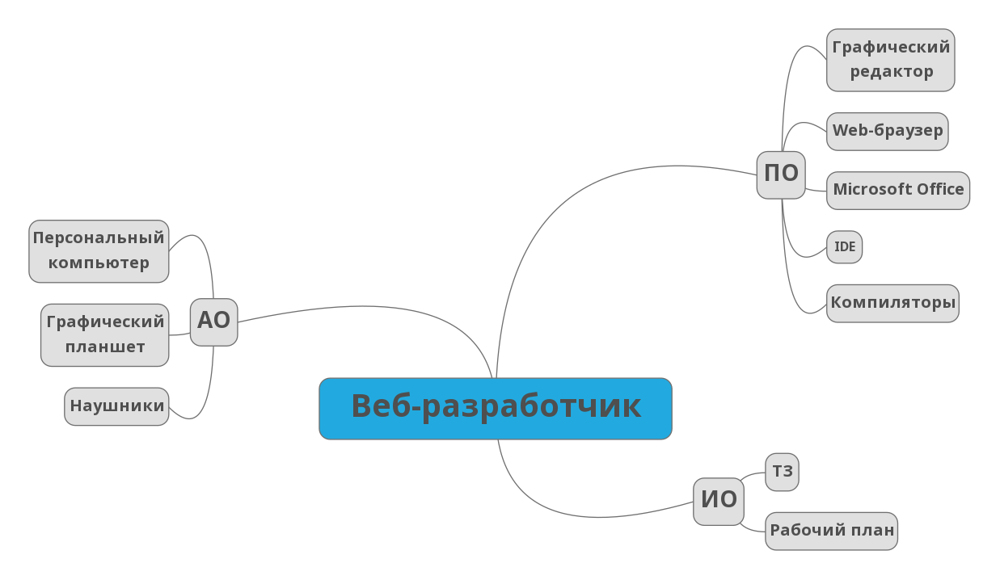

>Изучить и проанализировать аппаратное, программное и информационное обеспечение автоматизированного рабочего места специалиста в конкретной предметной области (по выбору студента). Оценка рабочего места специалиста.

